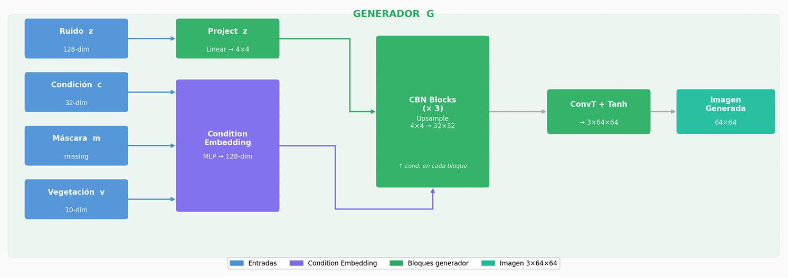
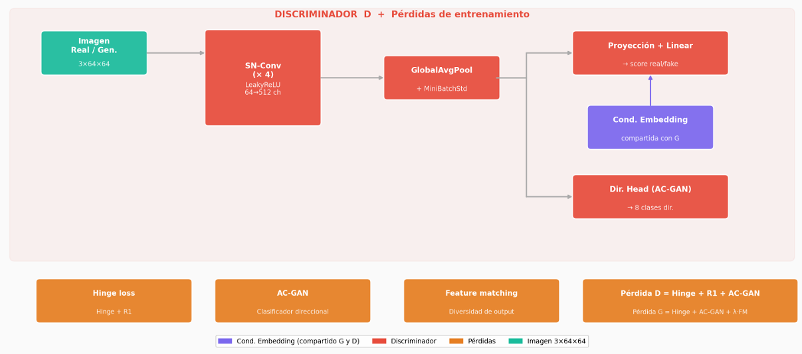
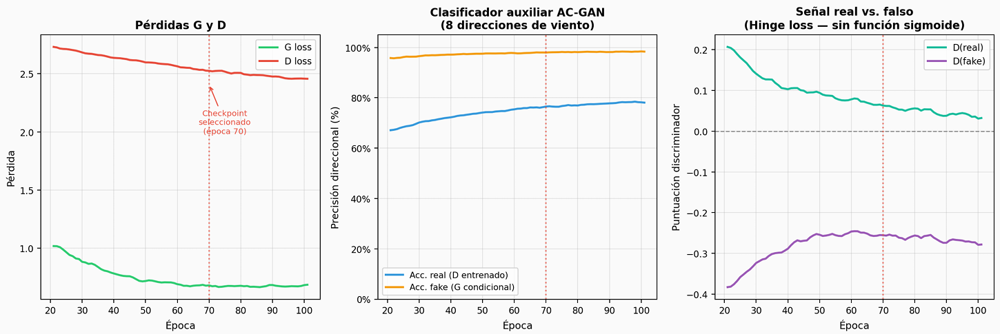
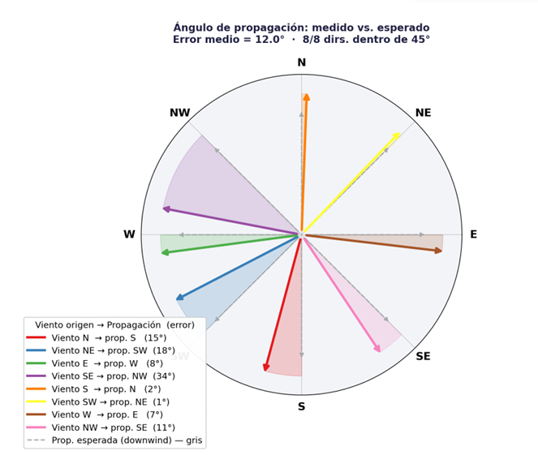
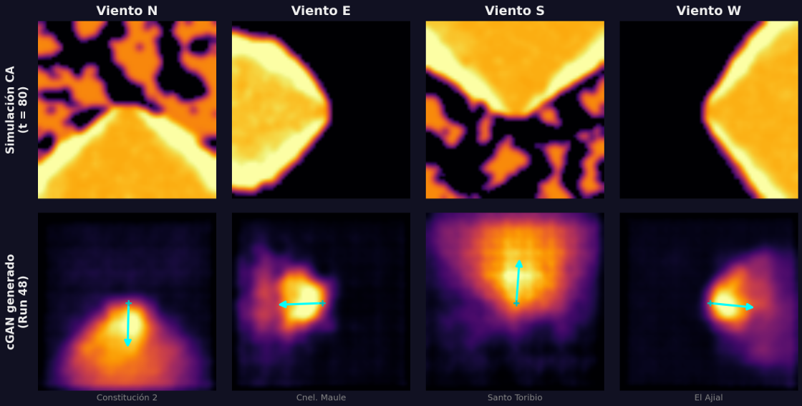

# IncendiosGAN — Wildfire Propagation via Conditional GAN

Generación de mapas sintéticos de propagación de incendios forestales en milisegundos, condicionados por dirección de viento, topografía y vegetación. Trabajo de título — Ingeniería Civil Informática, UTFSM.

---

## Overview

This project implements a **conditional GAN (cGAN)** that generates probabilistic wildfire propagation heatmaps given meteorological and environmental conditions. The model is trained on synthetic data from a cellular automaton (CA) simulator calibrated on 6,533 historical CONAF wildfire records (Maule region, 2011–2021).

**Key capability:** inference in milliseconds vs. hours for the CA simulator.

## Architecture

| Component | Detail |
|---|---|
| Generator | Noise + Condition Embedding → CBN Blocks (4×4 → 64×64) → ConvT + Tanh |
| Discriminator | SN-Conv ×4 → GlobalAvgPool + MiniBatchStd → Projection conditioning (Miyato) + AC-GAN head |
| Conditioning | Conditional Batch Normalization (CBN) in G; projection + AC-GAN auxiliary classifier in D |
| Losses | Hinge + R1 regularization (D); Hinge + AC-GAN + Feature Matching (G) |
| Training | TTUR — lr_D=4e-4, lr_G=1e-4; 100 epochs; Run 48 |




## Results

| Metric | Value |
|---|---|
| FID (Inception v3) | 282.97 |
| SSIM | 0.526 ± 0.180 |
| Directional conditioning | 8 / 8 wind directions |
| Angular error (CONAF val set) | 12.0° ± 10.0° |
| Robustness (70% missing fields) | SSIM > 0.50 |
| AC-GAN accuracy (generated) | ~97% |
| AC-GAN accuracy (referential CA) | ~79% |

Checkpoint selected at epoch 70 — first checkpoint with SSIM > 0.50 under 70% masking.





## Inputs

The model conditions on:
- **Continuous:** temperature (°C), relative humidity (%), wind speed (km/h), fire area (ha) — as z-scores
- **Categorical:** wind direction (8 classes), terrain exposure, topography — one-hot encoded
- **Vegetation profile:** 10-dim vector from CONAF land cover classification
- **Missing data mask:** any field can be marked as unknown at inference time

## Interactive Demo

```bash
pip install -r requirements.txt
python app.py --checkpoint outputs/checkpoints/run48/checkpoint_best_final.pt
```

Opens a Gradio web interface at `http://localhost:7860` with sliders for all meteorological inputs, wind direction and topology dropdowns, and multi-sample generation.

## Project Structure

```
src/
  ca/               # Cellular automaton simulator
  models/           # Generator, Discriminator, ConditionEmbedding
  training/         # Trainer, callbacks
  evaluation/       # FID, SSIM, Moran's I
  data/             # Dataset, preprocessing
scripts/            # Figure generation scripts
docs/               # Figures and supporting assets
outputs/
  checkpoints/run48/checkpoint_best_final.pt
  metrics/training_log_run48.csv
```

## Proof of Concept Scope

Validation compares generated propagation direction against theoretical downwind direction from CONAF meteorological records — not against observed real fire perimeters. Extending to real perimeter validation (dNBR Sentinel-2) is identified as future work.
